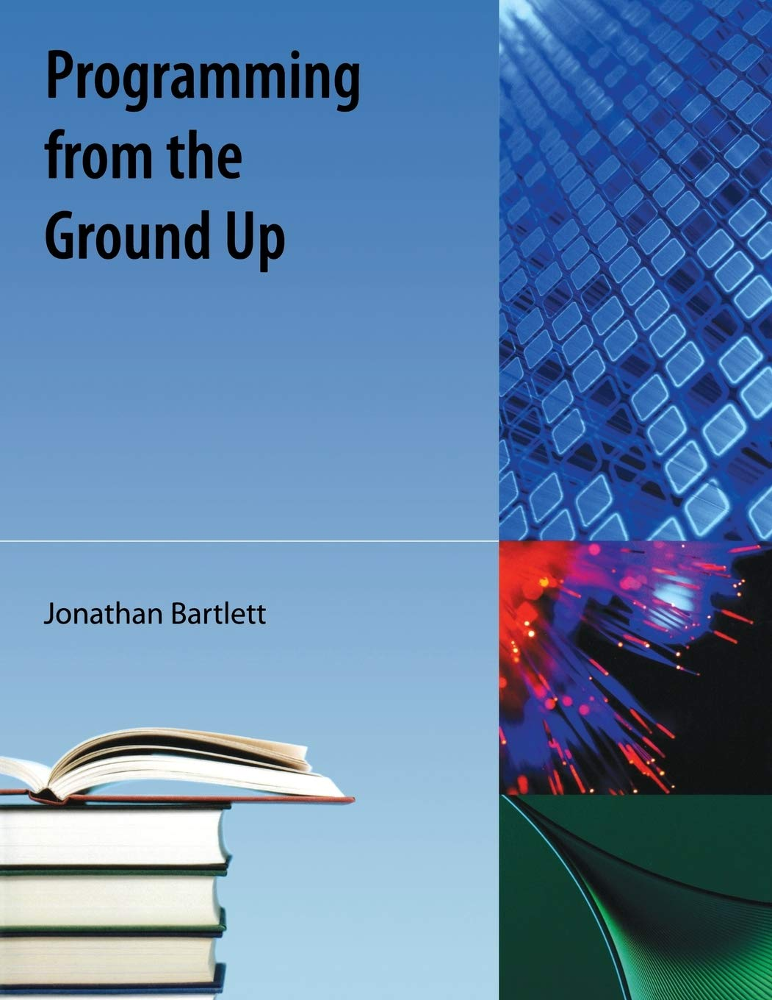

# Programming From The Ground Up

---

## Summary

This repository serves as a storage for notes/programs I write while reading the book "[Programming from the Ground Up](https://mirrors.sarata.com/non-gnu/pgubook/ProgrammingGroundUp-1-0-booksize.pdf "Full PDF of the book Programming from the Ground Up")" by Jonathan Bartlett.

---

## Contents

* [Chapter 2 Notes/Programs](./Chapter-2/ "My answers to the review questions at the end of chapter 1")

---

[Back To Top](#programming-from-the-ground-up "Jump To Top")
